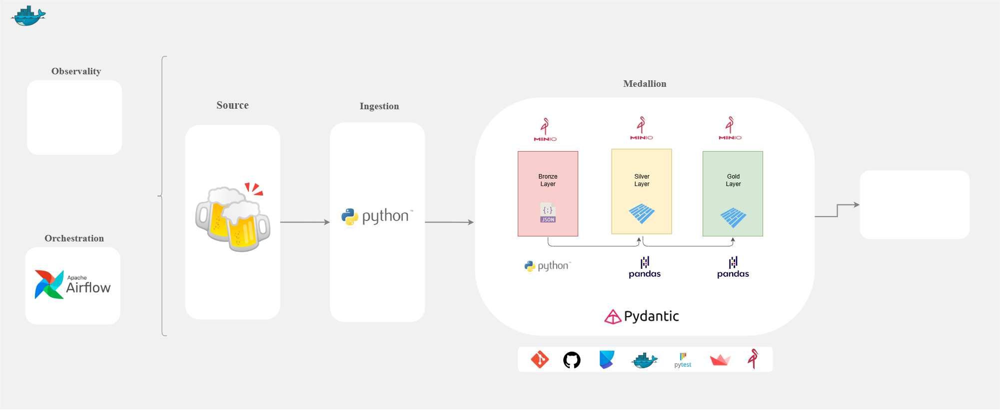

# Case Data Engineering Bees
Este projeto de arquitetura open source tem como foco a coleta de Breweries da ``Open Breweriy DB``, com armazenamento em um ``data lake`` e exibição em um dashboard interativo. A construção visa boas práticas e clareza em todos os aspectos, da arquitetura à escrita do código.

### Objetivos:
* Implementar um data lake seguindo a arquitetura ``medallion``.
* Utilizar frameworks que seja compreensivel e simples na resolução do case.
* Armazenar os dados na camada Bronze em formato JSON com Python.
* Realizar transformações nas camadas Silver e Gold com ``pandas`` salvando no formato Parquet.
* Utilizar o airflow para orquestrar as ``camadas``.
* Escrever *testes unitários* utilizando ``pytest``.
* Criar um dashboard com ``Streamlit`` para visualização gráfica dos dados da camada Gold.
* Subir todos os serviços via ``Docker``.

A arquitetura proposta é a seguinte:
<table>
    <td>
    </img></td></tr>
</table>

**Principais ferramentas utilizadas no projeto:**  
- **Apache Airflow**: Responsável por orquestrar pipelines de dados, automatizando tarefas e seus agendamentos;  
- **MinIO**: Armazenamento de objetos gratuito usado para guardar e organizar os dados;  
- **Pandas**: Biblioteca Python usada para processar, transformar e analisar os dados;  
- **Docker**: Plataforma para criar e gerenciar containers, garantindo que os serviços rodem de forma consistente;  
- **Streamlit**: Utilizado para criar interfaces simples e rápidas para visualização de dados.  

## Descrição da Estrutura do Projeto
* `.git` - Controle de versão.
* `.venv` - Ambiente virtual com dependências do projeto.
* `.gitignore` - Arquivo de exclusões do Git.
* `.python-version` - Versão do python utilizada no projeto.
* `requirements.txt` - Dependências do projeto.
* `pyproject.toml` - Configurações e dependências do projeto com Poetry. 
* `README.md` - Documentação principal do projeto.
* `docs/` - Documentação do projeto.
* `src/backend/` - Arquivo com a construção do backend de dados.
* `src/frontend/` - Arquivo com a construção visual da entrega final.


## Estrutura do Projeto

```bash
|
|── .devcontainer/
|── .dockerignore
|── .docker-compose.yml
|── .gitignore
|── .python-version
|── requirements.txt
|── poetry.lock
|── pyproject.toml
|── README.md
|── config_airflow/
|   └── airflow.Dockerfile
|── data/
|── docs/
|── frontend/
|   |── components/
|   |       |── footer.py
|   |       └── inputs_css.py
|   |── configs/
|   |       └── settings_page.py
|   |── app.py
|   |── Dockerfile.py
|   └── requirements.txt
|── notebook/
|── src/
|   └── airflow/
|          └── dags/
|                |── resources/
|                |   |── __init__.py
|                |   └── minio_manager.py
|                |── scrapy/
|                |   |── __init__.py
|                |   |── collect.py
|                |   └── paramns.py
|                |── tools/
|                |   |── transform.py
|                |   └── rules_gold.py
|                |── __init__.py
|                |── bronze.py
|                |── silver.py
|                |── gold.py
|                └── TaskGroup.py
|
└── tests/
        |── test_1.py
        └── test_2.py
```

## Setup do Projeto

#### **1. Clone o repositório**
```bash
> git clone https://github.com/imbrunoagc/data-resident-evil.git
> cd data-resident-evil
```

#### **2. Execute o projeto**
```bash
> docker-compose up --build
``` 


#### **3. Serviços implementados**

* MiniIO > http://127.0.0.1:9001/
* Airflow > http://127.0.0.1:8080/
* Prometheus > http://127.0.0.1:9090/
* Streamlit > http://127.0.0.1:9000/
* MkDocs > i do not