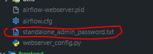
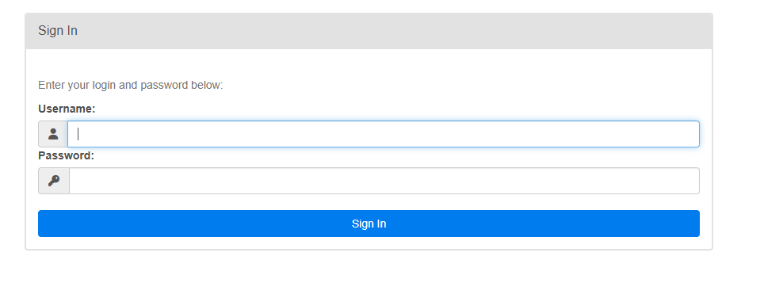
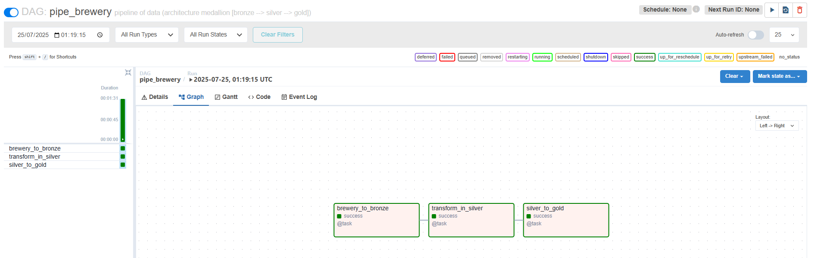

---

### 📄 `docs/airflow.md` – **Airflow**

```markdown
# Airflow

Acesse via: [http://localhost:8080](http://localhost:8080)

## Credenciais de Acesso

- **Usuário:** `admin`
- **Senha:** gerada automaticamente em  
  `src/backend/standalone_admin_password.txt`

⚠️ A cada rebuild do docker-compose, a senha é regenerada.

## Recuperação da senha



## Tela de Login



## DAG disponível


