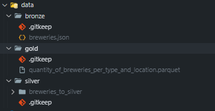

# Arquitetura Medallion

A arquitetura medallion, está concentrada na pasta local ``data/``.

O Objetivo era apresentar essa interface no ``Mini io``, devido a algumas problemas apresentados, realizei o downgrade para utilização local.

Atualmente o airflow está espelhando um volume ``data/`` com a raiz ``./data`` local do projeto.

